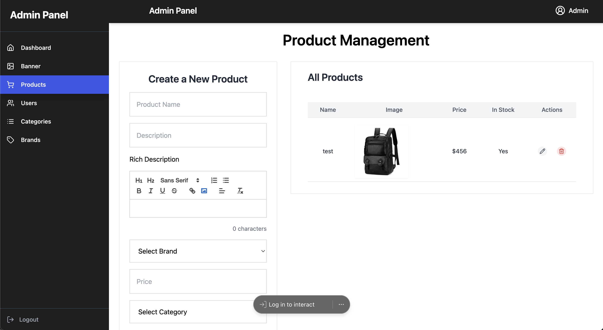
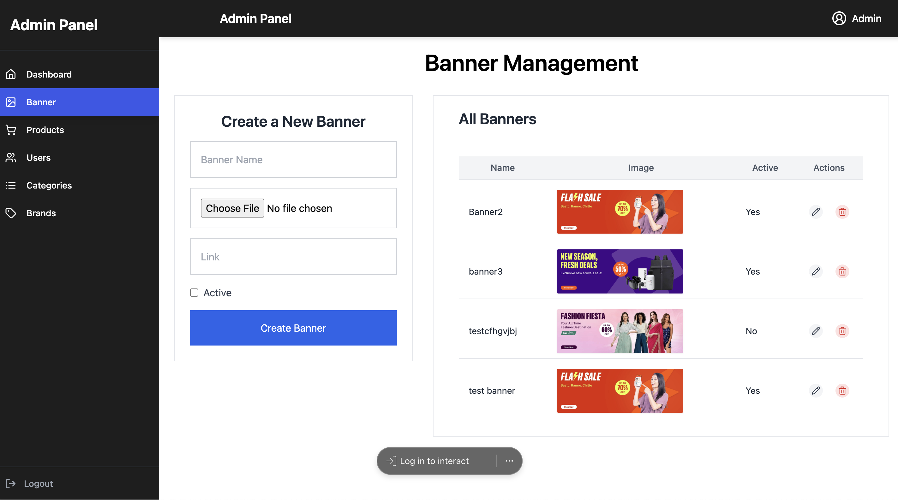
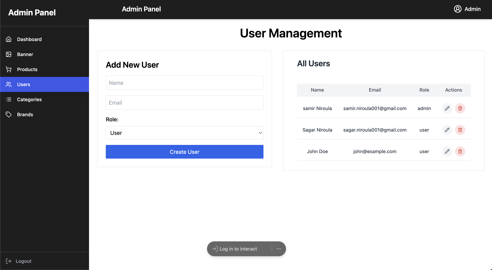
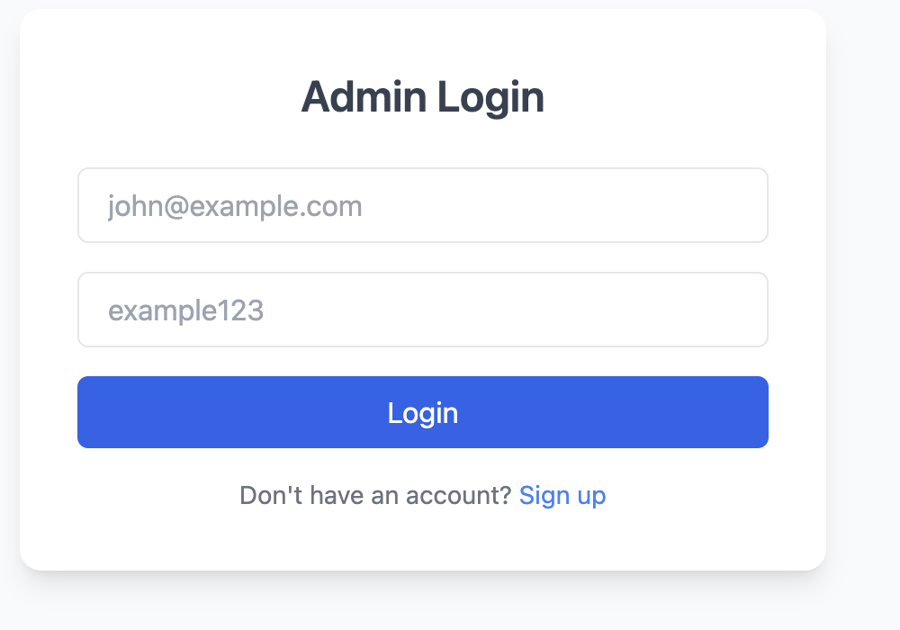
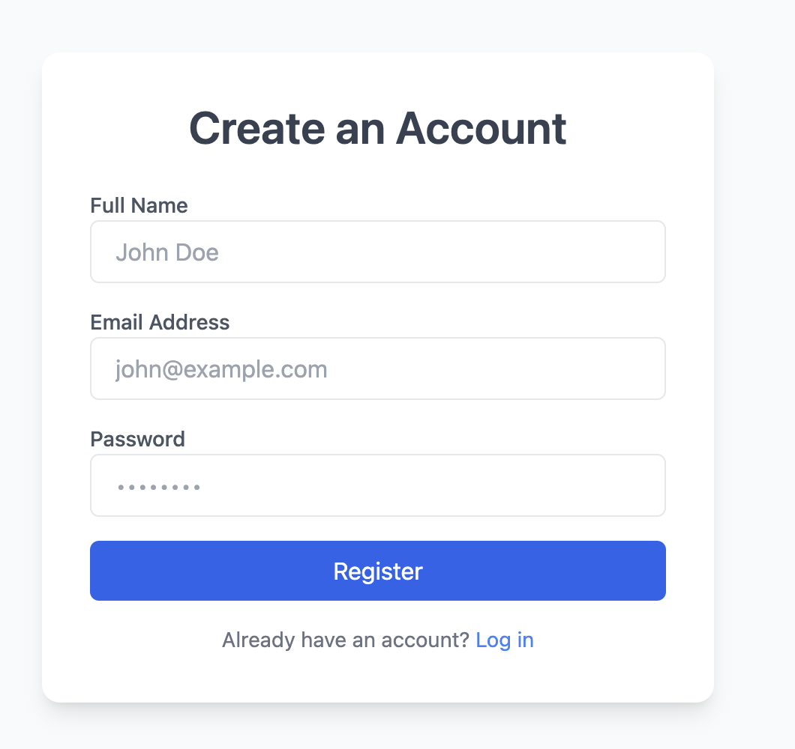

# E-commerce Admin Panel and Backend

## Features

- **Reviews**: Manage reviews.
- **Customers**: Manage customers.
- **Products**: Perform CRUD operations.
- **Banners**: Manage banners.
- **Categories**: Manage categories.
- **Brands**: Manage brands.
- **Collections**: Manage collections.
- **Admins**: Manage admin users.

## Technology Stack

- **Backend**: Express.js, MongoDB, Cloudinary, JWT
- **Frontend**: React.js, Tailwind CSS, Context API/Redux

## Workflow

1. **Backend**: Set up Express.js, MongoDB, Cloudinary, JWT.
2. **Frontend**: Set up React.js, Tailwind CSS.
3. **Integration**: Connect frontend and backend.
4. **Testing**: Test APIs and UI.

## Deliverables

1. Backend API
2. Admin panel
3. Cloudinary integration
4. Authentication and roles
5. Setup documentation

## Environment Variables

Create a `.env` file with the following content:

### In backend folder

```
API_URL=/api/v1
CONNECTION_STRING=""
CLOUDINARY_CLOUD_NAME=""
CLOUDINARY_API_KEY=""
CLOUDINARY_API_SECRET=""
JWT_SECRET=your_secret_key_here
```

### In admin folder

```
VITE_API_BASE_URL=http://localhost:3000/api/v1
```

## Contribution

This project is under active development. Contributions are welcome! Please feel free to collaborate and contribute to this open-source project.

## Screenshots









